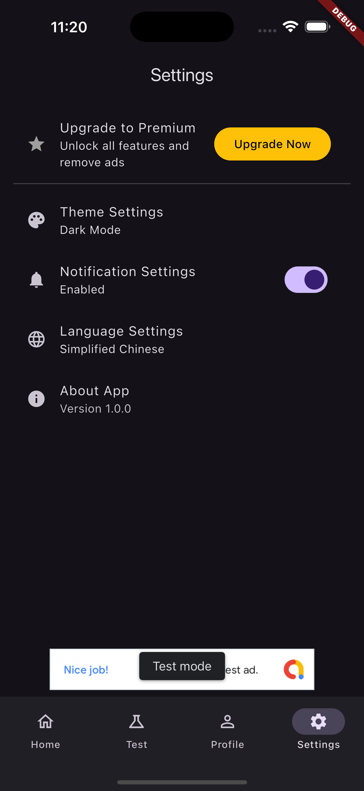

# Flutter JayJay Starter

A powerful Flutter application starter template with premium features, in-app purchases, and ad integration.

Copyright (c) 2024 JayJay Starter



## Features

- 🎨 Beautiful and modern UI
- 🌐 Multi-language support (English & Chinese)
- 🌓 Light/Dark theme support
- 💎 Premium membership system
- 💰 In-app purchases
- 📱 Ad integration
- 💾 Local database storage
- 🔒 User data management

## Getting Started

### Prerequisites

- Flutter SDK (latest stable version)
- Dart SDK (latest stable version)
- Android Studio / VS Code
- Android SDK / Xcode (for platform-specific development)

### Installation

1. Clone the repository:
```bash
git clone https://github.com/yourusername/flutter-jayjay-starter.git
```

2. Install dependencies:
```bash
cd flutter-jayjay-starter
flutter pub get
```

3. Configure your app:
   - Update app name in `lib/config/app_config.dart`
   - Configure your ad IDs
   - Set up in-app purchase products

4. Run the app:
```bash
flutter run
```

## Usage

### Premium Features

- Remove ads
- Unlimited requests
- Unlimited storage
- Unlimited history
- Advanced features

### In-App Purchases

- Monthly subscription
- Yearly subscription
- Lifetime access

### Ad Integration

- Banner ads
- Interstitial ads
- Rewarded ads

## Support

If you encounter any issues or have questions, please:

1. Check the [documentation](docs/DEVELOPMENT.md)
2. Search for existing issues
3. Create a new issue

## License

This project is licensed under the MIT License - see the [LICENSE](LICENSE) file for details.

## Acknowledgments

- Flutter team for the amazing framework
- All contributors and supporters
